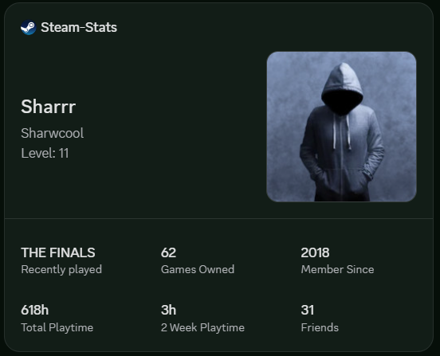
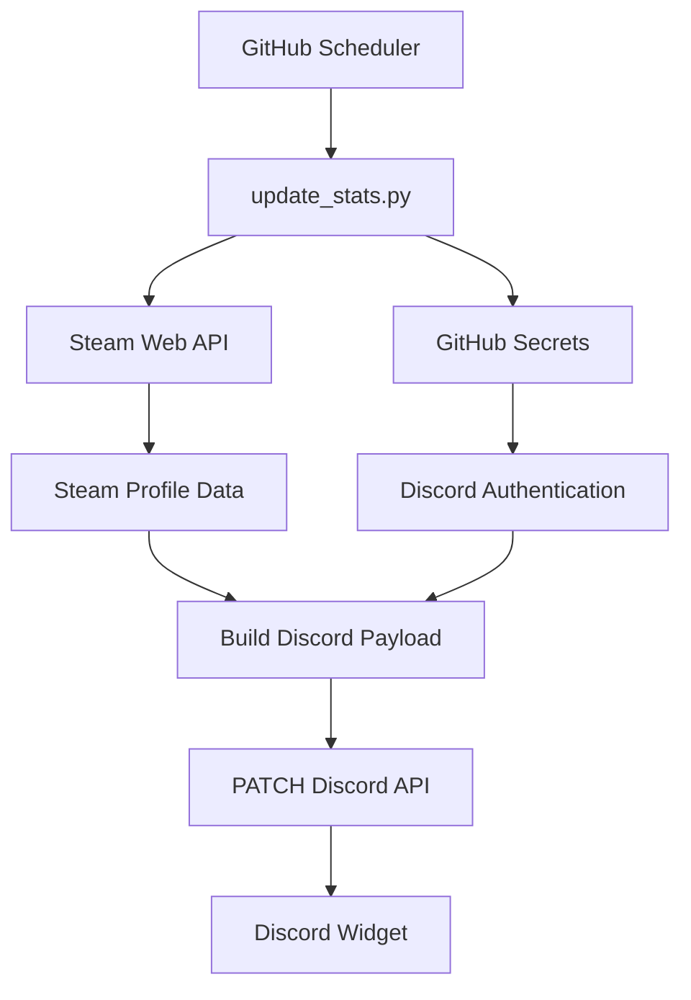

# 🎮 Discord Dynamic Steam Profile Widget

<div align="center">
  
</div>

> **Real-Time Steam Discord Widget Automation powered by the Steam Web API & GitHub Actions**

Automatically synchronize your public **Steam** profile statistics with Discord's **Dynamic Profile Widget** using the **Steam Web API**, **Python**, and **GitHub Actions**. No VPS, database, or always-on server required.

---


---

## 📸 Preview

<p align="center">
  
</p>

---

## ✨ Overview

This project fetches your public Steam profile information from the **Steam Web API**, converts it into Discord's Dynamic Widget payload format, and automatically updates your Discord profile on a schedule.

### ✅ Features

* 🎮 Steam Username
* 🖼 Profile Avatar
* ⭐ Steam Level
* 🎲 Total Owned Games
* ⏱ Total Playtime
* 📅 Playtime (Last 2 Weeks)
* 👥 Friend Count
* 📆 Steam Member Since
* 🎯 Recently Played Game
* ⚡ Fully automated updates via GitHub Actions

### 🏗 Infrastructure

* GitHub Actions
* Python 3.x
* Discord Widget API
* Steam Web API
* REST API Automation

> ✅ No VPS
> ✅ No server
> ✅ No database
> ✅ Runs entirely on GitHub Actions

---

## ⚙️ How It Works

1. GitHub Actions triggers on schedule or manually.
2. `update_stats.py` fetches your Steam profile using the Steam Web API.
3. The runtime gathers your profile information, Steam level, owned games, recently played games, and friends list.
4. Everything is transformed into a Discord Dynamic Widget payload.
5. Discord API receives a secure PATCH request using your bot token.
6. Your Discord widget updates automatically.

---

## 🚀 Setup

### 1. Fork this repository

Fork the repository and rename it if you want.

### 2. Create a Discord Application

> This project requires a Discord application with a Dynamic Profile Widget.

### Automatic Widget Creation

Use aamia's widget creation script:

https://gist.github.com/aamiaa/7cdd590e3949cd654758bc90bcb4710b

### Manual Widget Creation

Follow Chloe Cinders' guide:

https://chloecinders.com/blog/discord-widgets

After creating your widget, copy:

* Discord Application ID
* Discord Bot Token
* Discord User ID

### 3. Obtain a Steam Web API Key

Create one here:

https://steamcommunity.com/dev/apikey

You will need to enter a domain name when generating the key. For a personal project, `localhost` is fine.

### 4. Add GitHub Secrets

**Repository → Settings → Secrets and variables → Actions**

| Secret              | Value                  |
| ------------------- | ---------------------- |
| `STEAM_API_KEY`     | Steam Web API Key      |
| `STEAM_USER_ID`     | SteamID64              |
| `DISCORD_BOT_TOKEN` | Discord Bot Token      |
| `DISCORD_USER_ID`   | Discord User ID        |
| `DISCORD_APP_ID`    | Discord Application ID |

### 5. Run

Open:

```text
Actions → Update Steam Stats → Run workflow
```

After the first successful run, GitHub automatically updates your widget every 10 minutes.

**Local development:**

```bash
pip install requests
python update_stats.py
```

---

## 🧩 Widget Fields

Bind these field names in your Discord widget.

| Field                        | Type  | Example            |
| ---------------------------- | ----- | ------------------ |
| `steam_user_avatar`          | Image | Profile avatar URL |
| `steam_username`             | Text  | Sharrr             |
| `steam_level`                | Text  | 57                 |
| `steam_number_games`         | Text  | 312                |
| `steam_total_playtime`       | Text  | 120h               |
| `steam_total_playtime_2week` | Text  | 8h                 |
| `steam_member_since`         | Text  | 2017               |
| `steam_recently_played`      | Text  | THE FINALS         |
| `steam_friends`              | Text  | 31                 |

---

## 🏗 System Architecture



---

## 🌐 APIs Used

### Steam Web API

```text
GET https://api.steampowered.com/ISteamUser/GetPlayerSummaries/v0002/

GET https://api.steampowered.com/IPlayerService/GetSteamLevel/v1/

GET https://api.steampowered.com/ISteamUser/GetFriendList/v0001/

GET https://api.steampowered.com/IPlayerService/GetOwnedGames/v1/

GET https://api.steampowered.com/IPlayerService/GetRecentlyPlayedGames/v1/
```

### Discord Widget API

```http
PATCH https://discord.com/api/v9/applications/{APP_ID}/users/{USER_ID}/identities/0/profile
```

---

## 📦 Example Payload

```json
{
  "data": {
    "dynamic": [
      {
        "type": 3,
        "name": "steam_user_avatar",
        "value": {
          "url": "https://..."
        }
      },
      {
        "type": 1,
        "name": "steam_username",
        "value": "Sharrr"
      },
      {
        "type": 1,
        "name": "steam_level",
        "value": "57"
      },
      {
        "type": 1,
        "name": "steam_number_games",
        "value": "312"
      }
    ]
  }
}
```

---

## 🤖 GitHub Actions

Workflow:

```text
.github/workflows/update.yml
```

Schedule:

```yaml
schedule:
  - cron: "*/10 * * * *"
```

Manual execution is also supported from the **Actions** tab.

---

## 📂 Project Structure

```text
Steam-Stats/
├── update_stats.py
├── preview.png
├── README.md
└── .github/
    └── workflows/
        └── update.yml
```

---

## Credits

* [Freekillbio/Valorant-stats](https://github.com/Freekillbio/Valorant-stats)
* [ezxmora/discord-widget](https://github.com/ezxmora/discord-widget)
* Steam Web API
* Discord Dynamic Widgets

---

> This project is not affiliated with Valve or Discord.

### Notes

Some Steam profile data only appears if the related privacy setting is set to public:

* Owned games
* Recently played games
* Friend list

If you want to use your Steam API key, you can generate it from Steam’s API key page. For personal use, tools like SteamDB are also useful for looking up your SteamID64.
