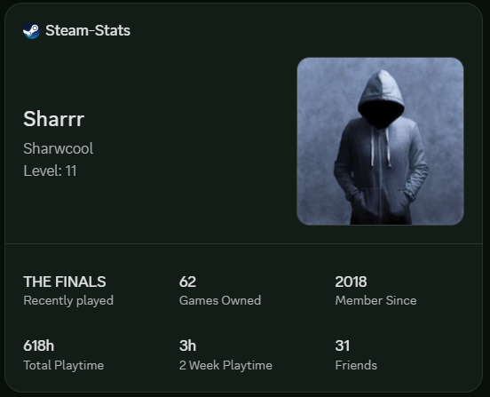
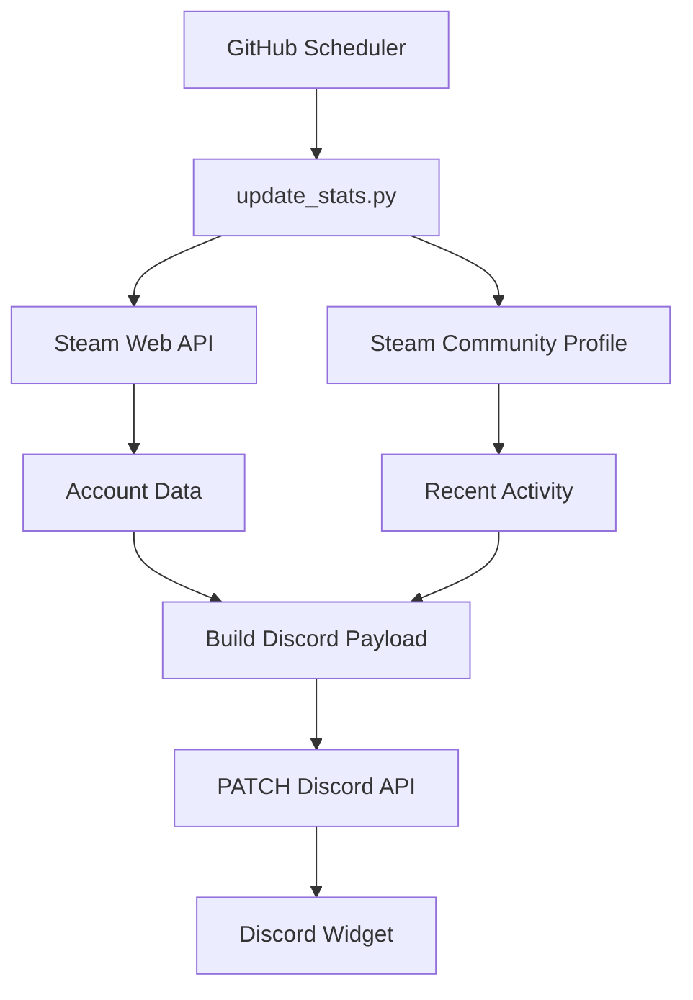

# 🎮 Discord Dynamic Steam Profile Widget

<div align="center">
  
</div>

> **Real-Time Steam Discord Widget Automation powered by the Steam Web API, Steam Community & GitHub Actions**

Automatically synchronize your public **Steam** profile statistics with Discord's **Dynamic Profile Widget** using the **Steam Web API**, **Steam Community**, **Python**, and **GitHub Actions**. No VPS, database, or always-on server required.

---


---

## 📸 Preview

<p align="center">
  
</p>

---

## ✨ Overview

This project automatically synchronizes your public **Steam** profile with Discord's **Dynamic Profile Widget**.

It combines the official **Steam Web API** with your public **Steam Community** profile to retrieve accurate account information, total playtime, and your actual most recently played game before converting everything into Discord's Dynamic Widget payload format.

---

## ✅ Features

- 🎮 Steam Username
- 🖼 Profile Avatar
- ⭐ Steam Level
- 🎲 Total Owned Games
- ⏱ Total Playtime
- 📅 Playtime (Last 2 Weeks)
- 🕹 Actual Recently Played Game
- 🎮 Recently Played Game Icon
- 👥 Friend Count
- 📆 Steam Member Since
- 🔄 Automatic Discord Widget Synchronization
- ⚡ Fully automated via GitHub Actions

---

## 🏗 Infrastructure

- GitHub Actions
- Python 3.x
- BeautifulSoup4
- Steam Web API
- Steam Community Profile
- Discord Widget API
- REST API Automation

> ✅ No VPS  
> ✅ No server  
> ✅ No database  
> ✅ Runs entirely on GitHub Actions

---

## ⚙️ How It Works

1. GitHub Actions triggers on a schedule or manually.
2. `update_stats.py` retrieves your Steam account information using the official Steam Web API.
3. The script reads your public Steam Community profile to determine your actual most recently played game.
4. The game's App ID is matched against your owned games to retrieve the official Steam game icon.
5. All information is transformed into a Discord Dynamic Widget payload.
6. Discord receives a secure PATCH request using your bot token.
7. Your Discord widget updates automatically.

---

# 🚀 Setup

## 1. Fork this repository

Fork this repository and rename it if you wish.

---

## 2. Create a Discord Application

> This project requires a Discord application with a Dynamic Profile Widget.

### Automatic Widget Creation

Use aamia's widget creation script:

https://gist.github.com/aamiaa/7cdd590e3949cd654758bc90bcb4710b

### Manual Widget Creation

Follow Chloe Cinders' guide:

https://chloecinders.com/blog/discord-widgets

After creating your widget, copy:

- Discord Application ID
- Discord Bot Token
- Discord User ID

---

## 3. Obtain a Steam Web API Key

Generate one here:

https://steamcommunity.com/dev/apikey

When asked for a domain name, you can simply enter:

```
localhost
```

---

## 4. Add GitHub Secrets

**Repository → Settings → Secrets and variables → Actions**

| Secret              | Value                  |
| ------------------- | ---------------------- |
| `STEAM_API_KEY`     | Steam Web API Key      |
| `STEAM_USER_ID`     | SteamID64              |
| `DISCORD_BOT_TOKEN` | Discord Bot Token      |
| `DISCORD_USER_ID`   | Discord User ID        |
| `DISCORD_APP_ID`    | Discord Application ID |

---

## 5. Run

Open

```text
Actions → Update Steam Stats → Run workflow
```

After the first successful run, GitHub automatically updates your widget every 10 minutes.

### Local Development

```bash
pip install requests beautifulsoup4

python update_stats.py
```

---

## 🧩 Widget Fields

Bind these field names inside your Discord Dynamic Widget.

| Field                        | Type  | Example        |
| ---------------------------- | ----- | -------------- |
| `steam_user_avatar`          | Image | Profile Avatar |
| `steam_username`             | Text  | Sharrr         |
| `steam_level`                | Text  | 57             |
| `steam_number_games`         | Text  | 312            |
| `steam_total_playtime`       | Text  | 120h           |
| `steam_total_playtime_2week` | Text  | 8h             |
| `steam_member_since`         | Text  | 2018           |
| `steam_recently_played`      | Text  | THE FINALS     |
| `steam_recent_game_icon`     | Image | Game Icon      |
| `steam_friends`              | Text  | 31             |

---

## 🏗 System Architecture


```mermaid
flowchart TD
    A[GitHub Scheduler] --> B[update_stats.py]

    B --> C[Steam Web API]
    B --> D[Steam Community Profile]

    C --> E[Account Data]
    D --> F[Recent Activity]

    E --> G[Build Discord Payload]
    F --> G

    G --> H[PATCH Discord API]
    H --> I[Discord Widget]
```

---

## 🌐 APIs Used

### Steam Web API

```text
GET https://api.steampowered.com/ISteamUser/GetPlayerSummaries/v0002/

GET https://api.steampowered.com/IPlayerService/GetSteamLevel/v1/

GET https://api.steampowered.com/ISteamUser/GetFriendList/v1/

GET https://api.steampowered.com/IPlayerService/GetOwnedGames/v1/

GET https://api.steampowered.com/IPlayerService/GetRecentlyPlayedGames/v1/
```

### Steam Community Profile

```text
GET https://steamcommunity.com/profiles/{STEAMID64}
```

Used to retrieve the user's **actual most recently played game**.

### Discord Widget API

```http
PATCH https://discord.com/api/v9/applications/{APP_ID}/users/{USER_ID}/identities/0/profile
```

---

## 📦 Example Payload

```json
{
  "data": {
    "dynamic": [
      {
        "type": 3,
        "name": "steam_user_avatar",
        "value": {
          "url": "https://..."
        }
      },
      {
        "type": 1,
        "name": "steam_username",
        "value": "Sharrr"
      },
      {
        "type": 1,
        "name": "steam_level",
        "value": "57"
      },
      {
        "type": 1,
        "name": "steam_number_games",
        "value": "312"
      },
      {
        "type": 1,
        "name": "steam_total_playtime",
        "value": "120h"
      },
      {
        "type": 1,
        "name": "steam_total_playtime_2week",
        "value": "8h"
      },
      {
        "type": 1,
        "name": "steam_member_since",
        "value": "2018"
      },
      {
        "type": 1,
        "name": "steam_recently_played",
        "value": "THE FINALS"
      },
      {
        "type": 3,
        "name": "steam_recent_game_icon",
        "value": {
          "url": "https://media.steampowered.com/steamcommunity/public/images/apps/2073850/9532db560dca3b4982f4af3f5981b6b2ce2a6909.jpg"
        }
      },
      {
        "type": 1,
        "name": "steam_friends",
        "value": "31"
      }
    ]
  }
}
```

---

## 🤖 GitHub Actions

Workflow

```text
.github/workflows/update.yml
```

Schedule

```yaml
schedule:
  - cron: "*/10 * * * *"
```

Manual execution is also supported from the **Actions** tab.

---

## 📂 Project Structure

```text
Steam-Stats-Discord-Widget/
├── update_stats.py
├── preview.png
├── README.md
└── .github/
    └── workflows/
        └── update.yml
```

---

## 📝 Notes

Some Steam information is only available when the corresponding privacy settings are set to **Public**, including:

- Owned Games
- Recently Played Games
- Friend List

This project combines the official Steam Web API with your public Steam Community profile to retrieve the most accurate information available.

To generate a Steam Web API key:

https://steamcommunity.com/dev/apikey

To find your SteamID64:

https://steamdb.info/calculator/

---

## Credits

This project was inspired by and builds upon ideas from:

- https://github.com/Freekillbio/Valorant-stats
- https://github.com/ezxmora/discord-widget

Additional services used:

- Steam Web API
- Steam Community
- Discord Dynamic Widgets

---

> This project is not affiliated with Valve Corporation or Discord Inc.
