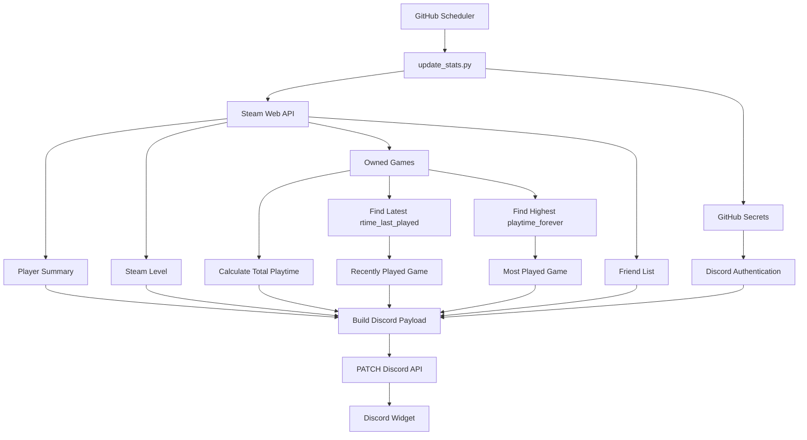

# 🎮 Discord Dynamic Steam Profile Widget

<div align="center">
  
</div>

> **Real-Time Steam Discord Widget Automation powered by the Steam Web API & GitHub Actions**

Automatically synchronize your public **Steam** profile statistics with Discord's **Dynamic Profile Widget** using the **Steam Web API**, **Python**, and **GitHub Actions**. No VPS, database, or always-on server required.

---


---

## 📸 Preview

<p align="center">
  
</p>

---

## ✨ Overview

This project fetches your public Steam profile information from the **Steam Web API**, processes your Steam statistics, converts them into Discord's Dynamic Widget payload format, and automatically updates your Discord profile on a schedule.

### ✅ Features

- 🎮 Steam Username
- 🖼 Profile Avatar
- ⭐ Steam Level
- 🎲 Total Owned Games
- ⏱ Total Playtime
- 📅 Playtime (Last 2 Weeks)
- 🕹 Recently Played Game + Icon
- 🏆 Most Played Game + Icon
- ⏱ Most Played Game Hours
- 👥 Friend Count
- 📆 Steam Member Since
- 🔄 Automatic Discord Widget Sync
- ⚡ Fully automated via GitHub Actions

### 🏗 Infrastructure

- GitHub Actions
- Python 3.x
- Discord Widget API
- Steam Web API
- REST API Automation

> ✅ No VPS  
> ✅ No server  
> ✅ No database  
> ✅ Runs entirely on GitHub Actions

---

## ⚙️ How It Works

1. GitHub Actions triggers on schedule or manually.
2. `update_stats.py` fetches your public Steam profile using the Steam Web API.
3. Steam profile information, level, owned games, playtime, and friends are retrieved.
4. The most recently played game is determined using the highest `rtime_last_played` value from the owned games list.
5. The most played game is determined using the highest `playtime_forever` value.
6. Game icons are generated using the Steam App ID and `img_icon_url`.
7. The collected data is transformed into a Discord Dynamic Widget payload.
8. Discord receives a PATCH request using your bot token.
9. Your Discord widget updates automatically.

---

## 🚀 Setup

### 1. Fork this repository

Fork the repository and rename it if you want.

### 2. Create a Discord Application

> This project requires a Discord application with a Dynamic Profile Widget.

### Automatic Widget Creation

Use aamia's widget creation script:

https://gist.github.com/aamiaa/7cdd590e3949cd654758bc90bcb4710b

### Manual Widget Creation

Follow Chloe Cinders' guide:

https://chloecinders.com/blog/discord-widgets

After creating your widget, copy:

- Discord Application ID
- Discord Bot Token
- Discord User ID

### 3. Obtain a Steam Web API Key

Create one here:

https://steamcommunity.com/dev/apikey

You will need to enter a domain name when generating the key. For a personal project, `localhost` is fine.

### 4. Add GitHub Secrets

Go to:

**Repository → Settings → Secrets and variables → Actions**

| Secret              | Value                  |
| ------------------- | ---------------------- |
| `STEAM_API_KEY`     | Steam Web API Key      |
| `STEAM_USER_ID`     | SteamID64              |
| `DISCORD_BOT_TOKEN` | Discord Bot Token      |
| `DISCORD_USER_ID`   | Discord User ID        |
| `DISCORD_APP_ID`    | Discord Application ID |

### 5. Run

Open:

```text
Actions → Update Steam Stats → Run workflow
```

After the first successful run, GitHub automatically updates your widget every 10 minutes.

### Local Development

Install the required dependency:

```bash
pip install requests
```

Then run:

```bash
python update_stats.py
```

> When running locally, the required environment variables must also be configured on your machine.

---

## 🧩 Widget Fields

Bind these field names in your Discord widget.

| Field                        | Type  | Example                   |
| ---------------------------- | ----- | ------------------------- |
| `steam_user_avatar`          | Image | Profile avatar URL        |
| `steam_username`             | Text  | Sharrr                    |
| `steam_user_id`              | Text  | Sharwcool                 |
| `steam_level`                | Text  | 57                        |
| `steam_number_games`         | Text  | 62                        |
| `steam_total_playtime`       | Text  | 469h                      |
| `steam_total_playtime_2week` | Text  | 18h                       |
| `steam_member_since`         | Text  | 2018                      |
| `steam_friends`              | Text  | 31                        |
| `steam_recently_played`      | Text  | THE FINALS                |
| `steam_recent_game_icon`     | Image | Recently played game icon |
| `steam_most_played_game`     | Text  | THE FINALS                |
| `steam_most_played_hours`    | Text  | 284h                      |
| `steam_most_played_icon`     | Image | Most played game icon     |

---

## 🕹 Recently Played Game Detection

The project does not rely on the `GetRecentlyPlayedGames` endpoint to determine the latest game.

Instead, it uses the `rtime_last_played` value returned by `GetOwnedGames`.

The game with the highest timestamp is selected:

```python
last_game = max(
    owned_games,
    key=lambda game: game.get("rtime_last_played", 0),
    default=None
)
```

This allows the widget to continue displaying the latest played game even after the user is no longer actively playing it.

---

## 🏆 Most Played Game Detection

The most played game is determined using the `playtime_forever` value returned for each owned game.

```python
most_played_game = max(
    owned_games,
    key=lambda game: game.get("playtime_forever", 0),
    default=None
)
```

The total playtime is returned by Steam in minutes and converted to hours:

```python
most_played_hours = f"{most_played_game['playtime_forever'] // 60}h"
```

---

## 🖼 Game Icon URLs

Steam provides an `img_icon_url` hash for games returned by `GetOwnedGames`.

The project builds the full game icon URL using:

```text
https://media.steampowered.com/steamcommunity/public/images/apps/{appid}/{img_icon_url}.jpg
```

For example:

```text
App ID: 2073850
Icon Hash: 9532db560dca3b4982f4af3f5981b6b2ce2a6909
```

becomes:

```text
https://media.steampowered.com/steamcommunity/public/images/apps/2073850/9532db560dca3b4982f4af3f5981b6b2ce2a6909.jpg
```

---

## 🏗 System Architecture


```mermaid
flowchart TD
    A[GitHub Scheduler] --> B[update_stats.py]

    B --> C[Steam Web API]

    C --> D[Player Summary]
    C --> E[Steam Level]
    C --> F[Owned Games]
    C --> G[Friend List]

    F --> H[Calculate Total Playtime]
    F --> I[Find Latest rtime_last_played]
    F --> J[Find Highest playtime_forever]

    I --> K[Recently Played Game]
    J --> L[Most Played Game]

    B --> M[GitHub Secrets]
    M --> N[Discord Authentication]

    D --> O[Build Discord Payload]
    E --> O
    H --> O
    K --> O
    L --> O
    G --> O
    N --> O

    O --> P[PATCH Discord API]
    P --> Q[Discord Widget]
```

---

## 🌐 APIs Used

### Steam Web API

#### Player Summary

Used for the Steam username, avatar, profile URL, and account creation time.

```text
GET https://api.steampowered.com/ISteamUser/GetPlayerSummaries/v0002/
```

#### Steam Level

```text
GET https://api.steampowered.com/IPlayerService/GetSteamLevel/v1/
```

#### Owned Games

Used for:

- Total number of games
- Total playtime
- Playtime during the last two weeks
- Recently played game
- Most played game
- Game App IDs
- Game icon hashes

```text
GET https://api.steampowered.com/IPlayerService/GetOwnedGames/v1/
```

#### Friend List

```text
GET https://api.steampowered.com/ISteamUser/GetFriendList/v1/
```

### Discord Widget API

```http
PATCH https://discord.com/api/v9/applications/{APP_ID}/users/{USER_ID}/identities/0/profile
```

---

## 📦 Example Payload

```json
{
  "data": {
    "dynamic": [
      {
        "type": 3,
        "name": "steam_user_avatar",
        "value": {
          "url": "https://..."
        }
      },
      {
        "type": 1,
        "name": "steam_username",
        "value": "Sharrr"
      },
      {
        "type": 1,
        "name": "steam_user_id",
        "value": "Sharwcool"
      },
      {
        "type": 1,
        "name": "steam_level",
        "value": "57"
      },
      {
        "type": 1,
        "name": "steam_number_games",
        "value": "62"
      },
      {
        "type": 1,
        "name": "steam_total_playtime",
        "value": "469h"
      },
      {
        "type": 1,
        "name": "steam_total_playtime_2week",
        "value": "18h"
      },
      {
        "type": 1,
        "name": "steam_member_since",
        "value": "2018"
      },
      {
        "type": 1,
        "name": "steam_friends",
        "value": "31"
      },
      {
        "type": 3,
        "name": "steam_recent_game_icon",
        "value": {
          "url": "https://media.steampowered.com/steamcommunity/public/images/apps/{appid}/{hash}.jpg"
        }
      },
      {
        "type": 1,
        "name": "steam_recently_played",
        "value": "THE FINALS"
      },
      {
        "type": 1,
        "name": "steam_most_played_game",
        "value": "THE FINALS"
      },
      {
        "type": 1,
        "name": "steam_most_played_hours",
        "value": "284h"
      },
      {
        "type": 3,
        "name": "steam_most_played_icon",
        "value": {
          "url": "https://media.steampowered.com/steamcommunity/public/images/apps/{appid}/{hash}.jpg"
        }
      }
    ]
  }
}
```

---

## 🤖 GitHub Actions

Workflow:

```text
.github/workflows/update.yml
```

Schedule:

```yaml
schedule:
  - cron: "*/10 * * * *"
```

Manual execution is also supported from the **Actions** tab.

---

## 📂 Project Structure

```text
Steam-Stats-Discord-Widget/
├── update_stats.py
├── preview.png
├── README.md
└── .github/
    └── workflows/
        └── update.yml
```

---

## 🔒 Privacy Requirements

Some Steam information is only available through the API when the corresponding Steam profile settings are public.

For the complete widget, make sure the relevant profile information is visible, including:

- Game details
- Owned games
- Playtime
- Friend list

If these are private, some widget fields may be unavailable.

---

## Credits

- [Freekillbio/Valorant-stats](https://github.com/Freekillbio/Valorant-stats)
- [ezxmora/discord-widget](https://github.com/ezxmora/discord-widget)
- Steam Web API
- Discord Dynamic Widgets

---

> This project is not affiliated with Valve or Discord.
